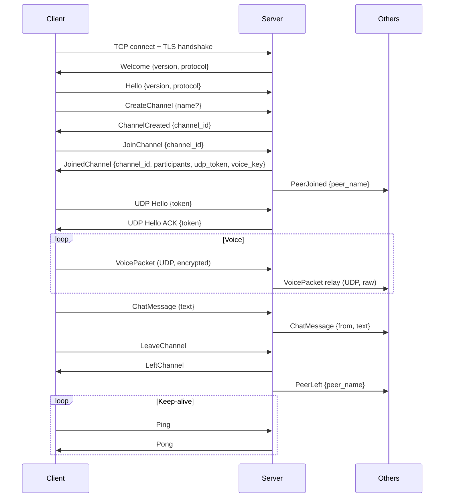

# Wire Protocol

Protocol version: **2** (`PROTOCOL_VERSION` in `config.rs`)

## Transport

| Channel | Transport | Port | Encoding | Encryption |
|---------|-----------|------|----------|------------|
| Control | TCP | 7100 | Length-prefixed bincode | TLS 1.3 (rustls) |
| Voice | UDP | 7101 | Custom binary | XChaCha20-Poly1305 |

## TCP Control Channel

### Framing

Every TCP message is a length-prefixed frame:

```
[4 bytes] payload_length (u32, big-endian)
[N bytes] payload (bincode-serialized message)
```

- Max frame size: 64 KB (`MAX_FRAME_SIZE = 65536`)
- Max pending buffer per client: 128 KB (`MAX_PENDING_BUF`)
- Heartbeat: client sends `Ping` every 10s, server responds `Pong`

### Client → Server Messages

| Variant | Fields | Description |
|---------|--------|-------------|
| `Hello` | `version: String, protocol: u16` | First message after TLS handshake |
| `CreateChannel` | `name: Option<String>` | Create channel (public if name set: `pub-<name>`) |
| `JoinChannel` | `channel_id: String` | Join existing channel |
| `LeaveChannel` | — | Leave current channel |
| `ListChannels` | — | Request public channel list |
| `ChatMessage` | `text: String` | Send text (max 4096 chars) |
| `SetName` | `name: String` | Change display name (max 32 chars) |
| `Ping` | — | Keep-alive |

### Server → Client Messages

| Variant | Fields | Description |
|---------|--------|-------------|
| `Welcome` | `version: String, protocol: u16` | First message after client connects |
| `ChannelCreated` | `channel_id: String` | Channel was created |
| `JoinedChannel` | `channel_id, participants: Vec<String>, udp_token: u64, voice_key: Vec<u8>` | Successfully joined |
| `PeerJoined` | `peer_name: String` | Someone joined your channel |
| `PeerLeft` | `peer_name: String` | Someone left your channel |
| `LeftChannel` | — | You left the channel |
| `ChatMessage` | `from: String, text: String` | Chat from a peer |
| `NameChanged` | `old_name: String, new_name: String` | Name change notification |
| `ChannelList` | `channels: Vec<ChannelInfo>` | List of public channels |
| `Error` | `message: String` | Error response |
| `Pong` | — | Keep-alive response |

## UDP Voice Channel

### Hello Handshake

After joining a channel via TCP, the client receives a `udp_token`. It must register its UDP address by sending a hello packet:

```
[0..4]  sequence: u32 = 0 (big-endian, marks this as hello)
[4..12] token: u64 (big-endian, from JoinedChannel)
```

Total size: **12 bytes**. Server echoes the hello back as ACK. Client retries up to 3 times with 200ms interval.

### Voice Packets

```
[0..4]   sequence: u32 > 0 (big-endian)
[4..5]   channel_id_len: u8
[5..5+N] channel_id: UTF-8 bytes
[rest]   opus_data: encrypted Opus frame
```

- `sequence = 0` is reserved for hello packets
- Opus: 48kHz mono, 20ms frames (960 samples)
- Encryption: XChaCha20-Poly1305 (32-byte key from `JoinedChannel.voice_key`)
  - Nonce: 24 bytes, prepended to ciphertext
  - Tag: 16 bytes, appended to ciphertext
- Max UDP packet: 1500 bytes

### Voice Relay

The server parses only the `channel_id` from voice packets (zero-copy) and relays the raw bytes to all other participants in the same channel. The server never decrypts voice data.

## Connection Lifecycle



## Rate Limiting

Server applies per-client token bucket rate limiting:

| Action | Rate | Burst |
|--------|------|-------|
| Commands | 20/sec | 10 |
| Channel creation | 2/sec | 1 |

## Security

- **TLS 1.3** for all TCP control traffic (self-signed certs, TOFU pinning)
- **XChaCha20-Poly1305** per-packet encryption for voice
- **No server-side decryption** — server relays encrypted voice as-is
- **No persistence** — no chat history, no voice recording, no logs of content
